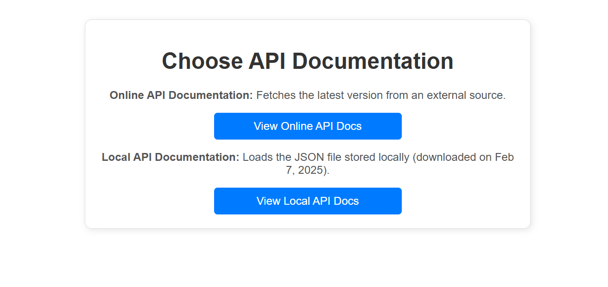

# epcisOpneAPI

Here is the link where i got the open api json files https://ref.gs1.org/standards/epcis/artefacts

## Docker Compose 
docker-compose up

## Github

git clone https://github.com/yalewkidane/epcisOpenAPI.git
git add -A
git commit -m "initial commit"
git push origin

## Docker Hub
docker build -t yaledoc/epcis_open_api:1.0 .
docker tag yaledoc/epcis_open_api:1.0 yaledoc/epcis_open_api:latest
docker push yaledoc/epcis_open_api:1.0
docker push yaledoc/epcis_open_api:latest

## How to 
goto /3045

